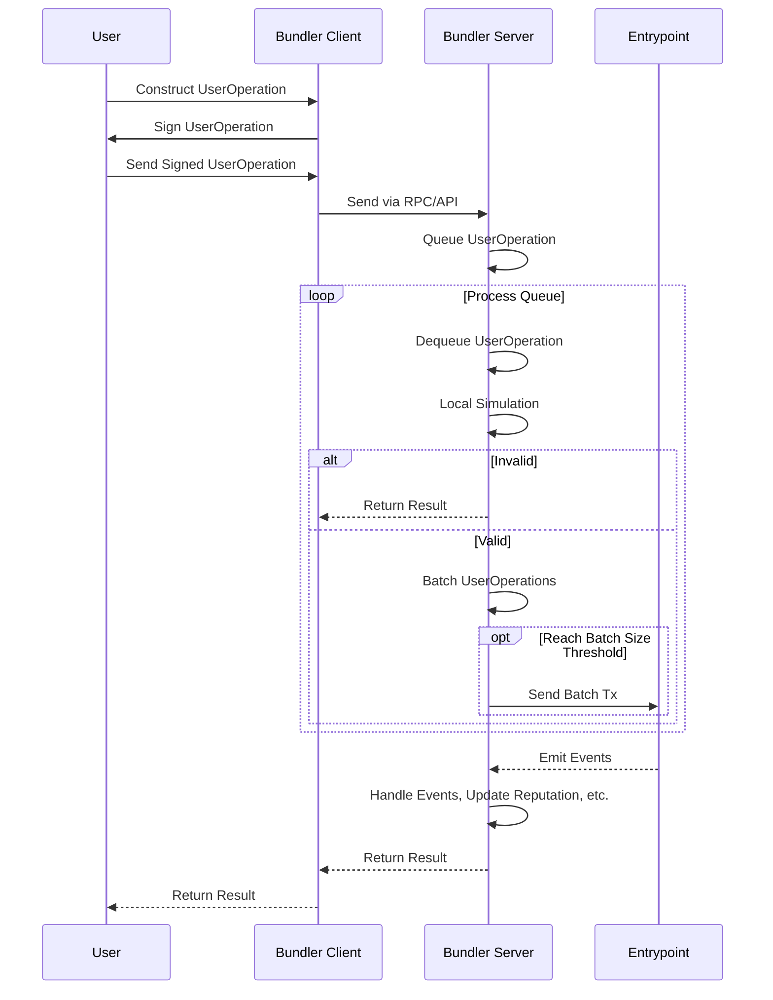
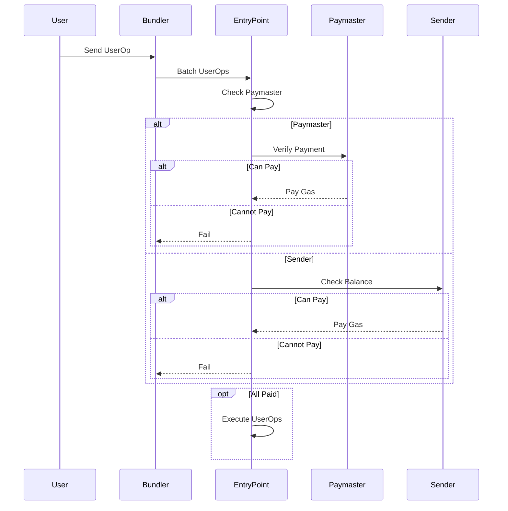

# Polkadot Smart Account

## Project Overview :page_facing_up:

Polkadot Smart Account is a project that brings Ethereum's EIP-4337 account abstraction to the Substrate ecosystem. It implements account abstraction at the application level without the need for blockchain-level protocol changes.

The project is initiated by the PNS project team, which provides a decentralized identity and account management solution. We believe that the Substrate and Polkadot ecosystems need their own account abstraction standards, which is why we started this project.

## Motivation :thought_balloon:

- Existing account management methods have usability issues and cannot provide a good user experience.

- Account abstraction can enhance security, support more account functions, and improve the user experience.

- The current account abstraction solution requires blockchain-level protocol changes, which are difficult to promote.

- The Substrate ecosystem needs an account abstraction standard that can be implemented without protocol changes.

## Solution :bulb:

Polkadot Smart Account implements account abstraction at the application level by introducing the concepts of User Operations and Bundlers, without the need for blockchain protocol adjustments.

It allows users to use smart contract wallets instead of Externally Owned Accounts (EOAs) as their main accounts, and the wallet contracts can contain any verification logic. It also supports payment management, signature aggregation, and other functions.

We will implement this solution in the `ink!` ecosystem and ultimately extract a PSP standard specification suitable for Substrate.

## User Operation Flow :repeat:

The User Operation flow is as follows:

1. The user constructs a UserOperation object containing the operation to be executed.

2. The user broadcasts the UserOperation to the public User Operation Memory Pool.

3. The Bundler retrieves UserOperations from the memory pool and runs a local simulation to verify their validity.

4. The Bundler bundles validated UserOperations into a transaction and calls Entrypoint's `handle_ops` method.

5. Entrypoint verifies and executes each UserOperation and interacts with the chain.

The Bundler plays a pivotal role in the User Operation flow by receiving, validating, batching, and ultimately sending UserOperations on-chain. Its workflow is shown in the following diagram:



After the Bundler bundles validated UserOperations and sends the transaction to Entrypoint, further processing logic is executed:

The Entrypoint contract implements the core logic for processing UserOperations. It contains methods like `handle_ops` to process batched UserOperations, `handle_aggregated_ops` for aggregated signatures, etc.

Entrypoint also implements functionalities related to deposit, withdrawal, gas payment, and deposit protection. It interacts with the chain to update state based on the UserOperations.

The workflow is shown below:



## Bundler :chains:

The Bundler is an independent component responsible for retrieving UserOperations, validating, batching, and sending them to Entrypoint for execution.

Its main functions include:

- Providing RPC/REST APIs to receive UserOperations

- Queuing and processing UserOperations

- Validating UserOperations via local simulation

- Batching validated UserOperations into transactions

- Calling Entrypoint's `handle_ops` to execute transactions

- Implementing a reputation system, event monitoring

- Caching, debugging interfaces

The Bundler enables the closed-loop User Operation flow, achieving account abstraction without blockchain changes.

The Bundler plays a key role by receiving, validating, batching user operations, and sending them to Entrypoint. It is a pivotal component that connects the off-chain User Operation construction and on-chain execution.

## Technical Details :wrench:

### EntryPoint Contract

The `EntryPoint` contract contains two main methods that implement the processing logic for `UserOperations`: `handle_ops` and `handle_aggregated_ops`.

The `handle_ops` method takes a batch of `UserOperation`s as input, validates and executes each operation. The method signature in Rust is as follows:

```rust
pub fn handle_ops(&mut self, ops: Vec<UserOperation>) -> Result<()>
```

The `handle_aggregated_ops` method is similar to `handle_ops`, but it is used for processing `UserOperation`s with signature aggregation. It first validates the signature aggregation and then validates and executes each operation. The method signature in Rust is as follows:

```rust
pub fn handle_aggregated_ops(&mut self, ops: Vec<UserOperation>) -> Result<()>
```

In addition to these methods, the `EntryPoint` contract also implements several related functions such as deposit, withdraw, and deposit security.

The `deposit` function is used to deposit funds for the user. The method signature in Rust is as follows:

```rust
pub fn deposit(&mut self) -> Result<()>
```

The `withdraw` function is used to withdraw funds for the user. It takes the amount to withdraw as input and returns a `Result` indicating success or failure. The method signature in Rust is as follows:

```rust
pub fn withdraw(&mut self, amount: Balance) -> Result<()>
```

Overall, the `EntryPoint` contract provides the main entry point for processing user operations and related functions for managing user funds.

### Bundler

The Bundler implements the key functionality of receiving, validating, batching user operations, and sending them to the Entrypoint for execution.

The Bundler provides RPC and REST APIs for receiving `UserOperations` from users:

```rust
#[rpc(server, client)]
pub trait BundlerRpc {

  /// Send a user operation.
  #[method(name = "sendUserOperation")]
  async fn send_user_op(&self, op: UserOperation) -> Result<OpHash, Error>;

  /// Get the status of a user operation.
  #[method(name = "getUserOpStatus")]
  async fn get_user_op_status(&self, op_hash: OpHash) -> Result<OpStatus, Error>;
}
```

After receiving a `UserOperation`, the Bundler adds it to a queue for processing:

```rust
#[derive(Debug, Serialize, Deserialize, Clone)]
pub struct UserOperation {
  //...
  pub signature: Vec<u8>,
}

// Add UserOperation to processing queue.
fn add_to_queue(user_op: UserOperation) {
  let queue = ...;
  queue.push(user_op);
}
```

The Bundler periodically takes `UserOperations` from the queue and performs local simulation to verify them:

```rust
// Periodically take and verify UserOperations from queue.
fn process_queue() {
  let user_op = queue.pop();
  if verify_user_op(user_op) {
    // Verification succeeded, batch process.
  } else {
    // Verification failed, return an error.
  }
}
```

After verification succeeds, the Bundler batches and packages the `UserOperations` and sends them to the Entrypoint for execution.

The Bundler implements the key functionality of taking user operations constructed off-chain and sending them on-chain for execution.

_Note: The interfaces shown are subject to change during further development._

## Team :busts_in_silhouette:

Our team consists of:

- cupnfish - Rust Engineer, responsible for core protocol development.
- jiang - Solidity Developer, responsible for smart contract development.
- fangda - Frontend Engineer, responsible for UI and frontend code.
- cat - Blockchain Researcher, responsible for operations and research.

The team has experience building blockchain solutions and won 1st place at the Polkadot Hackathon Smart Contracts track. We are excited to further develop Polkadot Smart Account into a production-ready solution.

## Development Roadmap :nut_and_bolt:

### Overview

- Total Estimated Duration: 3 months
- Full-Time Equivalent (FTE): 2
- Total Costs: $6,000 USD

### Milestone 1: Develop EntryPoint and Bundler

- Estimated Duration: 1.5 months
- FTE: 2
- Costs: $3,000 USD

| Number | Deliverable         | Specification                                             |
| ------ | ------------------- | --------------------------------------------------------- |
| 0a.    | License             | Apache 2.0                                                |
| 0b.    | Documentation       | We will provide documentation for EntryPoint and Bundler. |
| 0c.    | Testing Guide       | Core functions will have unit test coverage (80+%).       |
| 0d.    | Article             | We will publish an article explaining the work.           |
| 1.     | EntryPoint Contract | Implement core logic for processing UserOperations.       |
| 2.     | Bundler             | Implement receiving, validating, batching UserOperations. |
| 3.     | Docker Image        | Provide docker image for testing.                         |

### Milestone 2: Integrate Apple PASSKEY

- Estimated Duration: 1 month
- FTE: 2
- Costs: $2,000 USD

| Number | Deliverable             | Specification                                                                                    |
| ------ | ----------------------- | ------------------------------------------------------------------------------------------------ |
| 1      | Integrate Apple PASSKEY | Integrate Apple's PASSKEY standard to enable passwordless and phishing-resistant authentication. |
| 2      | Documentation           | Update documentation for PASSKEY integration.                                                    |
| 3      | Testing                 | Update tests for PASSKEY integration.                                                            |
| 4      | Tutorial                | Publish tutorial for using PASSKEY with user operations.                                         |

Apple's PASSKEY standard allows passwordless authentication that is resistant to phishing attacks. We will integrate this standard to allow users to directly sign with biometrics etc. without needing to manage keys themselves. This further simplifies the user operation flow and improves security.

### Milestone 3: Improve User Experience

- Estimated Duration: 0.5 month
- FTE: 2
- Costs: $1,000 USD

| Number | Deliverable   | Specification                                |
| ------ | ------------- | -------------------------------------------- |
| 1.     | Frontend Code | Improve frontend code and user interface.    |
| 2.     | Mobile App    | Develop mobile app for UserOperations.       |
| 3.     | Documentation | Improve documentation and add more examples. |

### Budget

Total Budget: $6,000 USD

## Conclusion :checkered_flag:

The Polkadot Smart Account project aims to implement the Substrate ecosystem's account abstraction standards at the application level, without the need for blockchain-level protocol changes. The project introduces `UserOperations` and `Bundlers` to enable smart contract wallets and support payment management, signature aggregation, and other functions.

The `UserOperation` flow is a closed-loop, with the `Bundler` as a key component. The `Bundler` is responsible for retrieving `UserOperations`, running local simulations, bundling validated `UserOperations` into transactions, and calling `EntryPoint`'s methods for execution.

The `EntryPoint` contract implements the processing logic for `UserOperations` and related functions such as deposit, withdrawal, and deposit protection.

The project's roadmap includes developing and testing `EntryPoint` and `Bundler`, conducting integration testing and security auditing, proposing a PSP standard specification suitable for Substrate, and promoting the project in the Polkadot ecosystem and collaborating with other projects.

The Polkadot Smart Account project addresses the usability issues of existing account management methods, enhances security, supports more account functions, and improves user experience.

## Additional Information :heavy_plus_sign:

**How did you hear about the Grants Program?**

We learned about the Web3 Foundation Grants Program through participating in Polkadot Hackathon.

**What work has been done already?**

We have developed a proof-of-concept implementation of the Polkadot Smart Account solution during the hackathon. This included basic contracts for the EntryPoint and Bundler components.

**Have you ever applied for other grants?**

Yes, our project "Polkadot Smart Account" won 1st place in the Smart Contracts track at the Polkadot Hackathon. This provided a grant to further develop the initial proof-of-concept.
