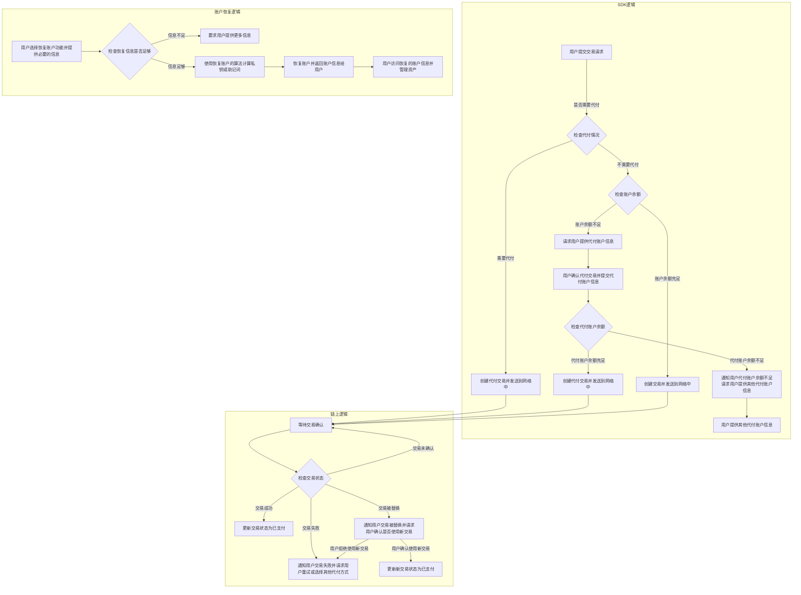
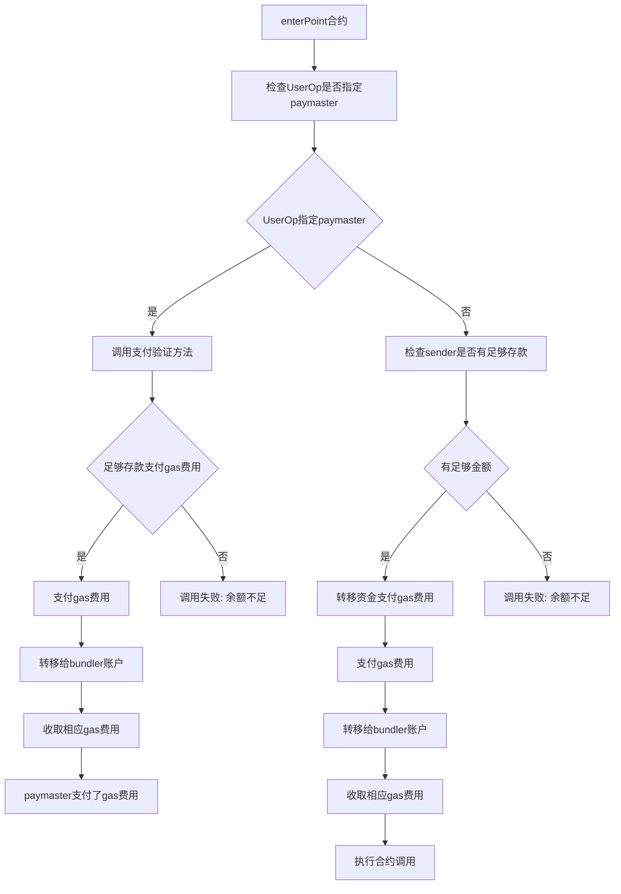

# Web3 Foundation Grants Program 申请书

## 项目名称:波卡生态中的账户抽象(基于ERC-4337)

### 项目描述 📄

我们的项目旨在将账户抽象(基于ERC-4337)集成到波卡生态中。我们的目标是为波卡生态中的用户提供更加便捷、安全的账户管理方式。我们的项目将侧重于社交恢复账号的功能,以提高用户在丢失账户访问权限时的恢复能力。此外,我们还计划在未来的版本中集成Passkey技术,以进一步提高用户的使用体验。

我们是一个经验丰富的区块链开发团队,热衷于构建新的去中心化网络基础设施。我们深知Polkadot生态系统的重要性,相信它将成为未来区块链应用的重要基础设施。我们的项目旨在为Polkadot生态系统中的用户提供更加便捷、安全的账户管理方式,同时也符合Web3基金会的整体愿景。  
  
在Polkadot生态系统中,当前的账户管理方式存在一些问题。用户可能会因为密码遗忘或泄露、助记词和私钥丢失或被盗等原因无法访问其账户或资产丢失。这些问题严重影响了用户的体验和资产安全。我们的项目旨在解决这些问题,并为用户提供更加便捷、安全的账户管理方式。

### 市场需求和竞争分析 🔍

在波卡生态中,已有一些账户管理方式,例如使用密码、助记词、私钥等方式管理账户。然而,这些方式存在一些缺点,例如密码容易被忘记或泄露、助记词和私钥容易被丢失或被盗。这些缺点可能导致用户无法访问其账户或资产丢失。  

我们的项目通过社交恢复账号的功能,可以帮助用户在丢失账户访问权限时快速恢复账户,从而保护用户的资产安全。此外,我们的账户管理方式更加便捷、安全,将为波卡生态中的用户带来更好的使用体验。我们的目标受众是有需要安全、方便账户管理的Polkadot生态系统用户。我们将与其他团队或组织合作,以增强该项目的实施能力和社区支持。我们相信,通过我们的不断努力和创新,我们的项目将在Polkadot生态系统中脱颖而出。

### 团队 👥

// TODO：

### 开发路线图 🔩

1. **阶段一**:我们将使用ink!开发第一个可用版本。这个版本将实现基本的账户抽象功能,并提供社交恢复账号的功能。  

2. **阶段二**:我们将对第一个版本进行测试和优化,以确保其稳定性和安全性。  

3. **阶段三**:我们将开始研究如何将Passkey技术集成到我们的项目中,以提高用户的使用体验。  

4. **阶段四**:我们将考虑将项目迁移到substrate,使用pallet进行开发。

### 技术细节和创新点 💡

我们的项目基于ERC-4337的账户抽象,将使用ink!进行开发。相较于原有实现，我们将侧重于社交恢复账号的功能,以提高用户在丢失账户访问权限时的恢复能力。此外,我们的账户管理方式更加便捷、安全,将为波卡生态中的用户带来更好的使用体验。  

我们计划在未来的版本中集成Passkey技术,以进一步提高用户的使用体验。Passkey技术是一种基于密码学的身份验证技术,可以提供更加安全、便捷的身份验证方式。我们相信,这些创新和必要的功能将为Polkadot生态系统中的用户带来更好的账户管理体验。

### 预算和资金用途 💰

我们希望获得XXX美元的资金支持,用于账户抽象的开发和实现。具体的资金用途包括:  

1. 开发团队薪资:XXX美元  
2. 服务器租用费用:XXX美元  
3. 其他必要的开销:XXX美元

这些开销将支持我们完成账户抽象的开发和实现。我们计划长期从我们的项目中产生收入,并为Polkadot生态系统的增长和发展做出贡献。

### 合作伙伴和社区支持 🤝

我们非常欢迎其他团队或组织与我们合作,共同推进我们的项目。我们愿意与其他Polkadot生态系统中的项目合作,以集成我们的解决方案,并为用户提供更好的账户管理体验。我们也希望与投资者和赞助商合作,获得资金支持,以加速我们的开发进程和实现我们的目标。我们相信,通过合作,我们可以共同构建一个更加强大、安全、便捷的Polkadot生态系统。  

我们计划与其他团队或组织合作,以增强该项目的实施能力和社区支持。我们将与区块链社区中的开发者和项目团队合作,共同推动波卡生态的发展。我们将与波卡生态中的DApp开发者合作,为其提供账户管理服务,以提高用户的使用体验。我们还将与区块链服务提供商合作,为其用户提供更好的服务。

### 项目的长期目标和愿景 🌟

我们的长期目标是成为波卡生态中账户管理的标准,为波卡生态中的用户提供更加便捷、安全的账户管理方式。我们将不断改进和完善我们的账户管理方式,并将其与其他波卡生态中的项目和应用集成,以实现波卡生态的互操作性。  

我们的愿景是通过我们的项目,为波卡生态的发展做出贡献,推动区块链技术的进步和应用。我们相信,区块链技术将改变未来的世界,我们希望成为这个变革过程中的一份子。我们相信,通过我们的不断努力和创新,我们的项目将在Polkadot生态系统中脱颖而出,为Polkadot生态系统的用户带来更好的体验。
