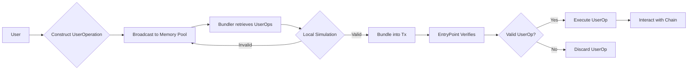

# Polkadot Smart Account

## Project Overview

Polkadot Smart Account 是一个将以太坊 EIP-4337 账户抽象方案移植到 Substrate 生态的项目。它可以在应用层面实现账户抽象,无需区块链层级协议变更。

该项目由 PNS 项目团队发起。PNS 是一个去中心化身份和账户管理方案。我们认为 Substrate 和 Polkadot 生态需要一个属于自己的账户抽象标准,所以启动了这个项目。

## Motivation

- 现有的账户管理方式(如私钥、助记词等)存在易用性问题,无法提供足够好的用户体验

- 账户抽象可以增强安全性（比如账号恢复）,支持更多账户功能,提升用户体验

- 目前的账户抽象方案需要区块链层级协议变更,推广难度大

- Substrate 生态需要一个无需协议变更就可以实现的账户抽象标准

## Solution

Polkadot Smart Account 通过引入用户操作(User Operation)和打包节点(Bundler)的概念,在应用层面实现账户抽象,无需区块链协议调整。

它允许用户使用智能合约钱包替代 EOA 作为主账号,钱包合约可以含有任意验证逻辑。同时还支持支付管理、签名聚合等功能。

我们将在 `ink!` 生态系统中实现这个方案,并最终提取出一个适用于 Substrate 的 PSP 标准规范。

## User OperationFlow

User Operation 流程如下:

1. 用户构建一个 UserOperation 对象,包含要执行的操作内容

2. 用户将 UserOperation 广播到公共的用户操作内存池

3. Bundler 从内存池中取出用户操作,运行本地模拟以验证其正确性

4. Bundler 将通过验证的用户操作打包成一个交易,调用 Entrypoint 的 `handle_ops` 方法 

5. Entrypoint 对每个用户操作运行验证,然后执行操作,与链交互



## Technical Details

该项目主要包含两个部分:

### EntryPoint Contract

EntryPoint 实现了对 UserOperation 的处理逻辑。它包含两个主要方法:

- `handle_ops`:处理普通的用户操作 

```rust
/// Handles a batch of [`UserOperation`]
pub fn handle_ops(&mut self, ops: Vec<UserOperation>) -> Result<()> {
  // 验证和执行每个 UserOperation
}
```

- `handle_aggregated_ops`:处理使用签名聚合的用户操作

```rust
/// Handles a batch of [`UserOperation`] with signature aggregation
pub fn handle_aggregated_ops(&mut self, ops: Vec<UserOperation>) -> Result<()> {
  // 验证签名聚合,然后对每个 UserOperation 验证和执行
}
```

EntryPoint 还实现了充值、提现和押金等相关功能:

```rust
/// 用户充值
pub fn deposit(&mut self) -> Result<()> {
  // 处理充值逻辑
}

/// 用户提现
pub fn withdraw(&mut self, amount: Balance) -> Result<()> {
  // 处理提现逻辑
}
```

### Bundler

Bundler 作为一个独立的组件,负责从用户操作内存池中取出用户操作,进行本地模拟验证,然后将通过验证的用户操作打包成一个交易。

它的工作流程如下:

1. 从用户操作内存池中获取尚未处理的用户操作
2. 对每个用户操作进行本地模拟
3. 将通过验证的用户操作打包成一个交易,调用 EntryPoint 的 `handle_ops` 方法
4. 为 EntryPoint 合约支付押金,以防止滥用

Bundler 可以是一个独立的应用程序,也可以集成到其他 Substrate 客户端或区块链浏览器中。

## Roadmap

1. 实现基于 `ink!` 的 EntryPoint 合约
2. 实现一个简单的 Bundler 组件
3. 进行集成测试和安全审计
4. 提出适用于 Substrate 的 PSP 标准规范
5. 推广到 Polkadot 生态,与其他项目合作

## Conclusion

Polkadot Smart Account 项目旨在为 Substrate 和 Polkadot 生态带来更好的用户体验,通过引入用户操作和打包节点的概念,在应用层面实现账户抽象。我们计划在 `ink!` 生态系统中实现这个方案,并最终提取出一个适用于 Substrate 的 PSP 标准规范。