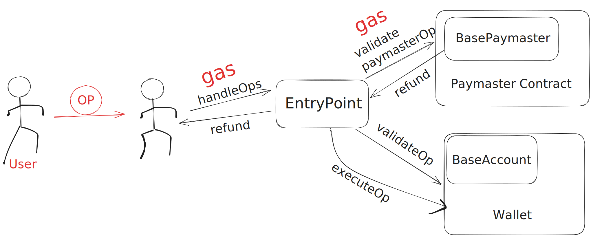

# Polkadot Smart Account

## 项目描述

该项目旨在为Polkadot生态中的用户提供更加便捷、安全的账户管理方式。项目将基于ERC-4337标准开发智能账户,实现社交恢复账号的功能,帮助用户在丢失账户访问权限时快速恢复账户。未来版本还会集成Passkey技术,进一步提高用户体验。



## 如何使用

您可以使用以下命令查看帮助文档：

```shell
cargo xtask -- -h
```

### 编译并导出合约

在项目目录下使用以下命令可以将编译好的合约输出到 `output` 文件夹中：

```shell
cargo xtask build -r -q
```

### 部署合约

在编译合约并得到 `*.contract` 文件后，可以使用以下命令部署合约：

```shell
cargo xtask deploy -s //Alice
```

## 开发路线图

1. 第一阶段:使用ink!开发第一个可用版本,实现基本账户抽象功能和社交恢复账号功能  
2. 第二阶段:测试和优化第一个版本,确保其稳定性和安全性
3. 第三阶段:研究如何将Passkey技术集成到项目中,提高用户体验  
4. 第四阶段:考虑将项目迁移到Substrate,使用Pallet进行开发

## 技术细节和创新点  

- 基于ERC-4337的账户抽象  
- 使用ink!开发,侧重于社交恢复账号功能,帮助用户快速恢复丢失的账户  
- 集成Passkey技术,提供更安全、便捷的身份验证方式,提高用户体验  

## 项目愿景  

本项目的愿景是为Polkadot生态系统的发展作出贡献,推动区块链技术进步和应用。项目团队相信区块链技术将改变未来,希望成为这一变革过程的一份子。项目将不断创新,提供Polkadot生态系统用户更好的体验。
