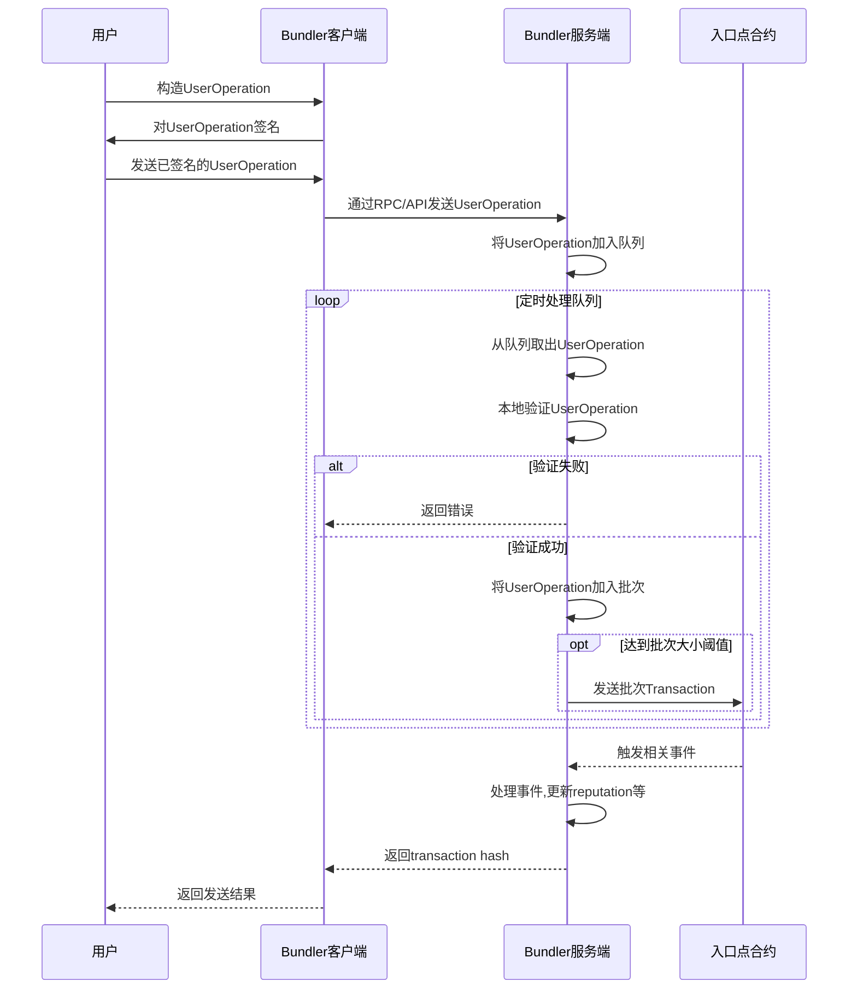

# Bundler

Bundler是一个实现账户抽象的服务端项目。它接收用户操作(User Operations),验证并批量发送到入口点合约。

## 简介

Bundler实现了[EIP-4337 ↗](https://eips.ethereum.org/EIPS/eip-4337)中定义的账户抽象规范。它通过接收和验证用户操作,将其打包并发送到入口点合约,实现了将普通账户转换为智能合约账户的功能。

本项目包含了bundler服务端需要实现的各项功能。你可以基于它来构建一个生产可用的bundler系统。

### Bundler客户端

Bundler客户端用于与bundler服务端交互,发送用户操作。

客户端实现了以下功能:

- 构造UserOperation对象
  客户端提供了构造Valid的UserOperation对象的方法。

- 发送UserOperation到服务端
  客户端封装了调用服务端RPC/REST接口的方法,用于发送UserOperation。

- 处理服务端返回
  客户端解析服务端的返回结果,在发送成功时返回operation hash,失败时返回错误详情。

- 获取区块链信息
  客户端连接节点,可以获取一些链上信息,如账户nonce、入口点地址等。

- 签名管理
  客户端可以持有私钥,对UserOperation进行签名。

#### 使用方式

1. 构造UserOperation对象

```js
const userOp = {
  //...
}

const signedUserOp = client.signUserOp(userOp)
```

2. 发送UserOperation

```js
const {hash, error} = await client.sendUserOp(signedUserOp)
```

3. 获取发送结果

```js
if(hash) {
  // 发送成功
} else {
  // 发送失败,处理error
}
```

## 功能Todo列表

### 实现bundler服务端逻辑

- [ ] 提供RPC或REST接口,用于接收user_op
- [ ] 将接收到的user_op存入队列
- [ ] 从队列中取出user_op,进行验证
  - [ ] 调用entry point的`simulateValidation`进行本地验证
  - [ ] 校验签名
  - [ ] 验证gas价格等
- [ ] 将验证通过的user_op打包
- [ ] 调用entry point的`handleOps`发送打包交易
- [ ] 实现reputation系统
  - [ ] 跟踪全局实体的表现
  - [ ] throttle和ban表现差的全局实体
- [ ] 连接区块链节点
  - [ ] 订阅相关事件
  - [ ] 获取最新区块信息
- [ ] 按需缓存或获取合约信息
  - [ ] 入口点地址
  - [ ] 已部署账户地址
- [ ] 实现Debug RPC方法,用于测试

### 实现bundler客户端

- [ ] 构建用户操作`UserOperation`对象
- [ ] 调用bundler的RPC或REST接口发送`UserOperation`
- [ ] 处理发送结果
  - [ ] 成功则返回`userOpHash`
  - [ ] 失败则返回错误信息
- [ ] 提供便捷的方法用于构建和发送特定操作
- [ ] 连接节点获取链上的信息
  - [ ] 账户nonce
  - [ ] 入口点地址等

### 示例

- [ ] 提供发送不同类型操作的示例
- [ ] 展示从构建到发送的完整流程

### 测试

- [ ] 单元测试关键组件
- [ ] 端对端集成测试

### 文档

- [ ] 接口文档
- [ ] 使用说明
- [ ] 注释关键代码


## Reputation系统

reputation系统用于防止一些全局实体(比如paymaster)进行DoS攻击。

它的工作原理是:

- 跟踪全局实体(paymaster, aggregator等)的交易表现
- 如果某实体导致大量交易失败,则降低其reputation分数
- reputation分数低于某阈值时,对其进行throttle或ban

这样可以防止全局实体发送大量错误交易,耗尽用户的gas。

reputation系统的具体实现包括:

- 为每个全局实体设置初始reputation分数
- 根据实体造成的交易失败等情况调整分数
- reputation分数过低时进行throttle或ban

## 工作流程图


